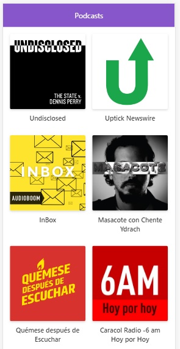

# Add de Podcasts

App de Podcasts integrada con la API de AudioBoom para aprender Next.JS

## ¿Cómo funciona?

Requiere Node.js 8.x

* `npm install` para instalar las dependencias.
* `npm run dev` para el entorno de desarrollo.
* `npm run build && npm start` para el entorno de producción.

## Licencia

MIT

## Demo

[Podcast live demo](https://podcasts-bkwaiavyko.now.sh/)
